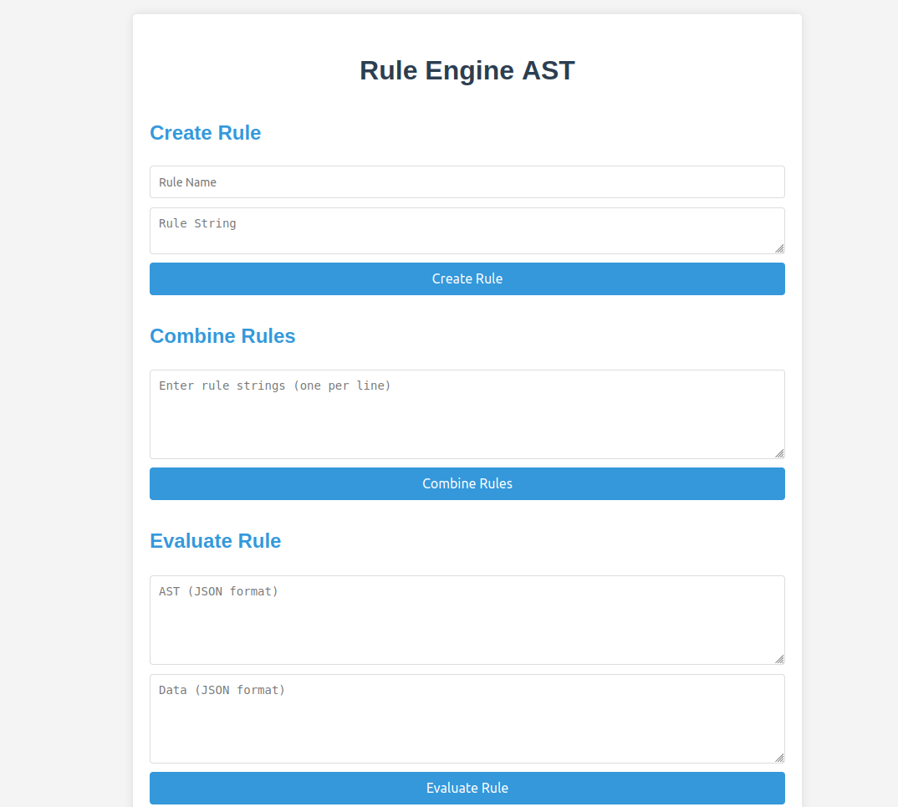

# Rule Engine AST Guide



A simple 3-tier rule engine application using Abstract Syntax Tree (AST) to determine user eligibility based on attributes like age, department, income, and spend.

---

## Working logic 


## Table of Contents

1. [Overview](#overview)
2. [Features](#features)
3. [Technology Stack](#technology-stack)
4. [Prerequisites](#prerequisites)
5. [Installation](#installation)
6. [Running the Application](#running-the-application)
7. [API Endpoints](#api-endpoints)
8. [Design Choices](#design-choices)
9. [Project Structure](#project-structure)

---

## Overview

This application provides a rule engine that uses Abstract Syntax Trees (AST) to represent conditional rules. It allows for dynamic creation, combination, and modification of these rules, as well as evaluation of data against the rules.

---

## Features

- Create rules using a string representation
- Combine multiple rules into a single AST
- Evaluate data against rules
- Simple UI for interacting with the rule engine

---

## Technology Stack

- Frontend: React.js
- Backend: Node.js with Express.js
- Database: MongoDB
- State Management: React Hooks

---

## Demo Video Available 
https://drive.google.com/file/d/13gKgdICp5AOR6qncwCFPqRmkQoXETwWx/view?usp=sharing

---

## Prerequisites

Before you begin, ensure you have met the following requirements:

- Node.js (v14.0.0 or later)
- npm (v6.0.0 or later)
- MongoDB (v4.0 or later)

---

## Installation

1. Clone the repository:

2. Install server dependencies:
   cd backend npm install

3. Install client dependencies:
   cd ../frontend npm install

---

## Running the Application

1. Start the MongoDB service on your machine.

2. Start the server:
   cd server npm start
   The server will run on `http://localhost:5000`.

3. In a new terminal, start the client:
   cd client npm start

The client will run on `http://localhost:3000`.

4. Open your browser and navigate to `http://localhost:3000` to use the application.

---

## API Endpoints

- POST `/api/create-rule`: Create a new rule
- POST `/api/combine-rules`: Combine multiple rules
- POST `/api/evaluate-rule`: Evaluate data against a rule

For detailed API documentation, refer to the [API Documentation](API_DOCUMENTATION.md) file.

---

## Design Choices

1. **MERN Stack**: We chose the MERN (MongoDB, Express.js, React.js, Node.js) stack for its flexibility, scalability, and the ability to use JavaScript throughout the stack.

2. **Abstract Syntax Tree (AST)**: ASTs are used to represent rules because they provide a flexible and powerful way to structure and evaluate complex logical expressions.

3. **Modular Architecture**: The backend is structured with separate routes, models, and utility functions for better organization and maintainability.

4. **React Hooks**: We use React Hooks for state management in the frontend, providing a clean and efficient way to handle component state and side effects.

5. **RESTful API**: The backend exposes a RESTful API, making it easy to interact with the rule engine from various clients.

6. **MongoDB**: MongoDB was chosen as the database for its flexibility in storing complex data structures like ASTs.

7. **Error Handling**: Comprehensive error handling is implemented both in the frontend and backend to provide clear feedback to users and developers.

8. **Minimal UI Design**: The frontend uses a clean, minimal design to focus on functionality while maintaining good user experience.

---

# Project Structure

```bash
rule-engine-ast/  
├── frontend/  
│   ├── public/  
│   ├── src/  
│   │   ├── components/  
│   │   ├── App.js  
│   │   ├── App.css  
│   │   └── index.js  
│   └── package.json  
├── backend/  
│   ├── models/  
│   ├── routes/  
│   ├── utils/  
│   ├── config.js  
│   ├── server.js  
│   └── package.json  
└── README.md  
```
