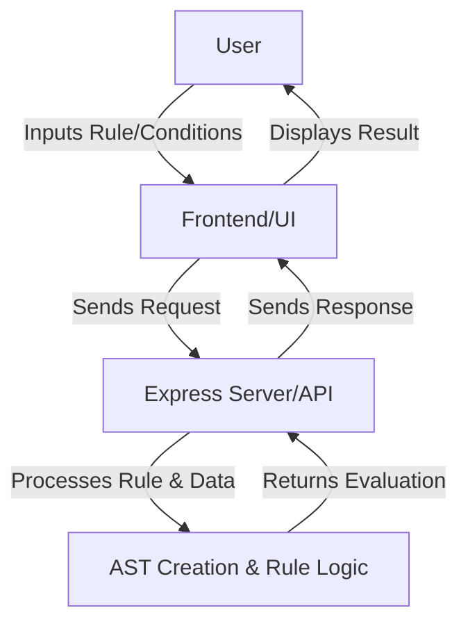

# Rule-based Engine  

## Rule Engine with Abstract Syntax Tree (AST)  

### Objective  
This project implements a 3-tier rule engine application that uses **Abstract Syntax Tree (AST)** to represent conditional rules. It allows dynamic creation, combination, and evaluation of rules based on user attributes such as age, department, salary, and experience. The rule engine evaluates whether a user meets specific criteria according to the defined rules.

---

## Table of Contents  
- [Flow Diagram](#flow-diagram)  
- [Features](#features)  
- [Technologies Used](#technologies-used)  
- [Dependencies](#dependencies)  
- [Project Structure](#project-structure)  
- [Installation and Setup](#installation-and-setup)  
- [API Design](#api-design)  
- [Example Rules](#example-rules)   
- [Future Enhancements](#future-enhancements) 
- [Conclusion](#conclusion)  

---

## Flow Diagram  


---

## Features  
- **Dynamic Rule Creation:** Create rules from strings and convert them into Abstract Syntax Trees (ASTs).  
- **Rule Combination:** Combine multiple rules using **AND / OR** logical operators.  
- **Flexible Evaluation:** Dynamically evaluate user data against the rules.  
- **Error Handling:** Identify and manage invalid rules or missing data attributes gracefully.  
- **Rule Modification:** Modify AST nodes dynamically to adjust rules.  

---

## Technologies Used  
- **Node.js:** Backend framework.  
- **Express.js:** Web framework for API creation.  
- **Mermaid:** For flowchart rendering in Markdown.  
- **JavaScript:** Core language for logic and AST manipulation.  

---

## Dependencies  
Install the following dependencies:  

```bash
npm install express body-parser
```
- **Express:** Web framework to build the backend server.  
- **Body-Parser:** Middleware to parse incoming JSON requests.  

---

## Project Structure  

```bash
/project-root  
│── /public              # Frontend UI files  
│── server.js            # Backend server code  
│── package.json         # Project dependencies and scripts  
```

---

## Installation and Setup  

### Clone the repository:  
```bash
git clone <repository-url>  
cd project-root  
```
### Install dependencies:  
```bash
npm install  
```
### Start the server:  
```bash
node server.js  
```
### Open the browser and go to:  
```text
http://localhost:3000
```
---

## API Design  

### POST /create_rule  
**Description:** Converts a rule string into an AST.  
**Request Example:**  
```json
{
  "ruleString": "age > 30 AND department = 'Sales'"
}
```

```json
{
  "ast": { "type": "operator", "value": "AND", "left": {...}, "right": {...} }
}
```

---

## Example Rules

**Rule 1:**
```text
(age > 30 AND department = 'Sales') OR (experience > 5 AND salary > 50000)
```

**Rule 2:**
```text
(department = 'Marketing' AND age < 25) OR (experience > 3)
```

---

## Future Enhancements
- **UI Integration:** Build a user interface for creating and testing rules visually.
- **Database Integration:** Store rules in a database for persistence and retrieval.
- **Performance Improvements:** Use caching to improve rule evaluation speed.
- **Advanced Features:** Allow user-defined functions within rules for complex logic.

---

## Conclusion
This project demonstrates the power of rule engines using Abstract Syntax Trees (ASTs). It provides dynamic rule creation, combination, and evaluation capabilities, making it suitable for various applications such as access control, business logic, and data filtering. With planned enhancements like UI integration and database storage, this engine can evolve into a more comprehensive solution.
